# Beehave - Minecraft Datapack

Quality of life tools for **Minecraft Java Edition** `1.20.6`

## Features

- **Disks** can be broken inside a stonecutter then made into a different disk.
- **Slabs** can be crafted back into their original blocks (except for copper).
- **Bone Meal** can be used on sugar canes to grow them.
- **Bone Meal** can be used on flowers to duplicate them.

## `2x2` Crafting Recipes

### Music Discs

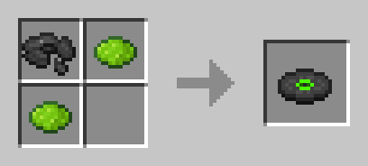
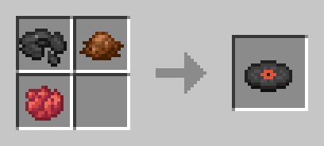

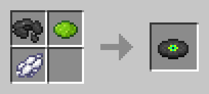
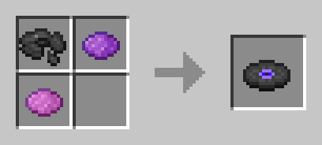
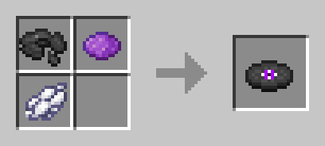
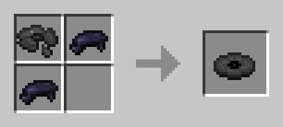
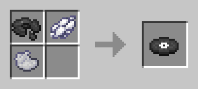
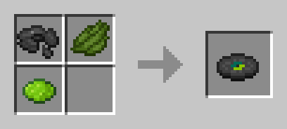
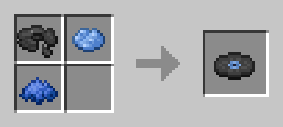
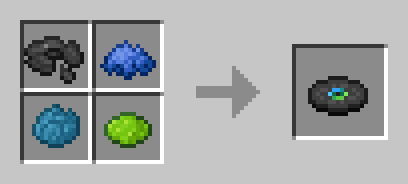

### `3x3` Crafting Recipes

### Stonecutting Recipes

### Smelting Recipes

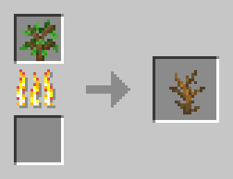

## Credits

- **Bone Meal** on sugar canes and flowers by
[Nincodedo](https://github.com/Nincodedo/mc-java-bedrock-bone-meal-datapack).
