# Beehave - Minecraft Datapack

Quality of life tools for **Minecraft Java Edition** `1.20.6`

## Features

- **Bone Meal** can be used on sugar canes to grow them.
- **Bone Meal** can be used on flowers to duplicate them.

## `2x2` Crafting Recipes

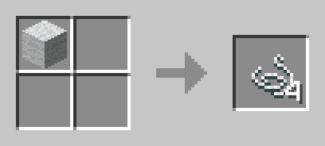

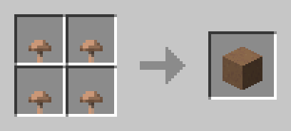
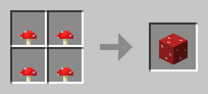

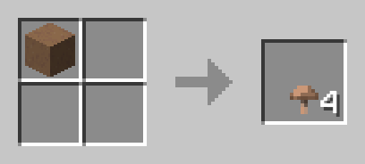
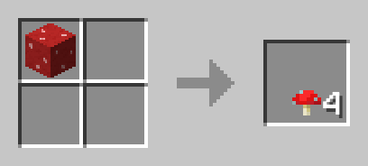

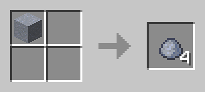

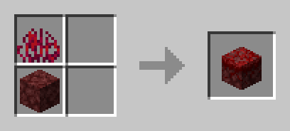
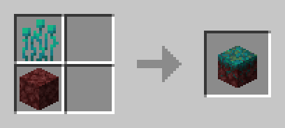
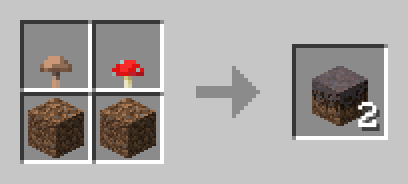
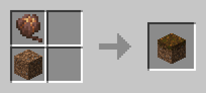

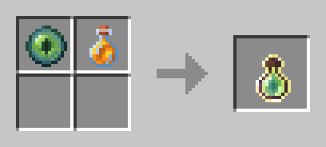
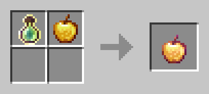

### `3x3` Crafting Recipes

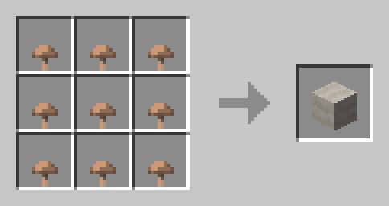

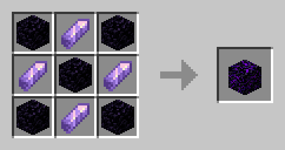

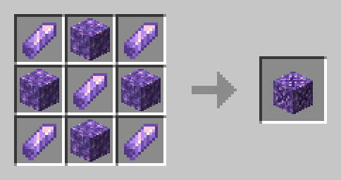

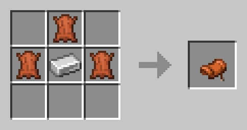
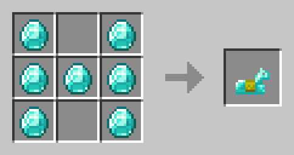
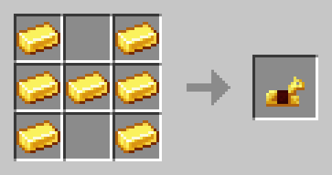
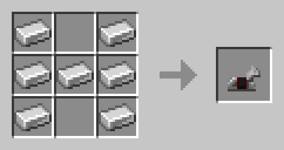

### Stonecutting Recipes

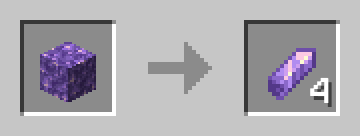
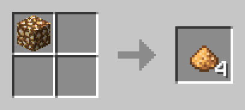

### Smelting Recipes

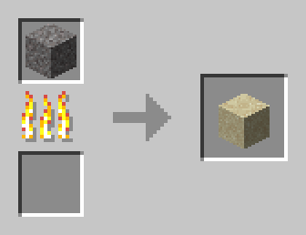
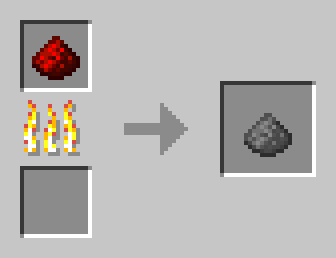
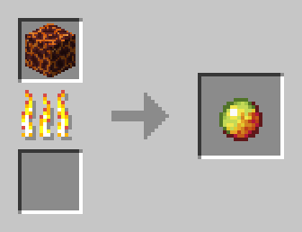
