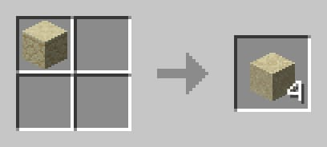

# Beehave - Minecraft Datapack

Quality of life tools for **Minecraft Java Edition** `1.21`

## Features

- **Slabs** can be crafted back into their original blocks (except for copper).

## `2x2` Crafting Recipes

### `3x3` Crafting Recipes

### Stonecutting Recipes

### Smelting Recipes

